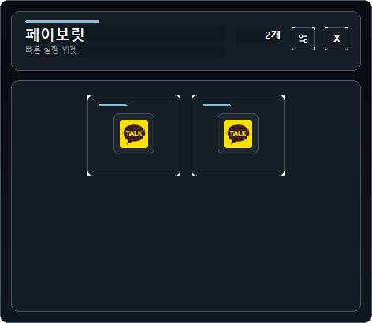
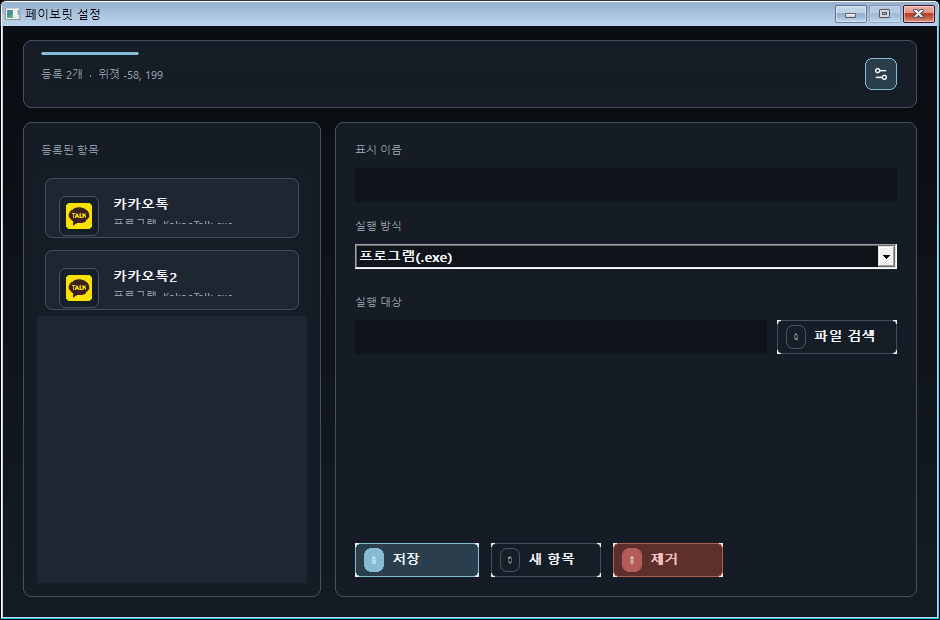

# Favorite Widget

Windows 바탕화면에서 자주 여는 앱, 파일, 링크를 바로 실행하는 즐겨찾기 위젯입니다.  
`C++ + Win32 API + CMake`로 만들었고, 설치 파일과 GitHub Pages용 소개 페이지까지 같이 정리해 둔 상태입니다.

## 핵심 기능

- Windows 바탕화면 뒤쪽에 붙는 빠른 실행 위젯
- `.exe`, 문서/파일, `http/https` 링크 등록
- 실행 파일 기본 아이콘을 그대로 써서 타일/목록 표시
- 별도 설정 창에서 추가, 수정, 삭제
- NSIS 기반 Windows 인스톨러 생성
- `docs/` 정적 페이지 포함

## 화면 미리보기




추가 캡처 이미지는 [docs/assets/screenshots/archive](docs/assets/screenshots/archive)에 정리했습니다.

## 요구 사항

- Windows 10 또는 Windows 11
- `g++`
- `cmake`
- `mingw32-make`

## 빌드

```powershell
cmake -S . -B build -G "MinGW Makefiles"
cmake --build build
```

또는:

```powershell
npm run build
```

## 실행

```powershell
.\build\favorite_widget.exe
```

또는:

```powershell
npm start
```

## 인스톨러 생성

```powershell
npm run installer
```

생성 결과물:

- `dist/FavoriteWidget-0.2.0-win64.exe`
- `docs/assets/downloads/FavoriteWidget-0.2.0-win64.exe`

## 소개 페이지 미리보기

GitHub Pages용 정적 페이지는 `docs/`에 있습니다.

```powershell
npm run site:preview
```

브라우저에서 `http://localhost:4173`을 열면 됩니다.

## 스모크 테스트

```powershell
.\build\favorite_widget.exe --smoke-test
```

또는:

```powershell
npm run smoke
```

## 저장 위치

설정 데이터는 아래 INI 파일에 저장됩니다.

```text
%LOCALAPPDATA%\FavoriteWidget\favorite-widget.ini
```
